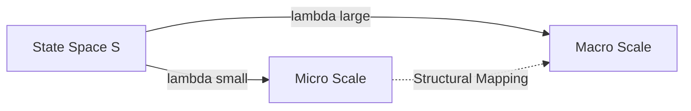

# Scaling Equality Model
## Micro–Macro Resolution Equivalence

---

## 1. Overview

本モデルは、観測スケール（Resolution Parameter λ）によって、
同一状態が異なる構造として現れることを定義する。

Micro と Macro は「別物」ではなく、
スケール変換による写像可能な構造である。

---

## 2. Mathematical Formulation

### State Space

S ∈ 𝒮  （宇宙の状態空間）

### Observation Operator

O_λ : 𝒮 → ℛ_λ

- λ_small  → Micro（高解像度・局所構造）
- λ_large  → Macro（低解像度・集合構造）

### Scale Relation

O_λ1(S) ≠ O_λ2(S)

ただし、スケール変換 T が存在する場合：

T(O_λ1(S)) ≈ O_λ2(S)

これを Structural Mapping と呼ぶ。

---

## 3. Conceptual Diagram

---

# 4. Interpretation Layer

## 4.1 Micro Focus
局所情報の精密観測。
高解像度で個別構造を見る。
## 4.2 Macro Focus
集合的振る舞いの観測。
低解像度でパターンを見る。
## 4.3 Equality Definition
Equality とは情報の同一性ではなく、
構造的写像可能性（Structural Mappability） を指す。

---

---
# 5. Behavioral Synchronization Protocol
---

本モデルは「宇宙を操作する」理論ではない。
観測解像度を整えることで、行動精度を高めるモデルである。
## 5.1 Sync Principle
Before attempting to influence Macro,
stabilize Micro behavior.
## 5.2 Operational Guidelines
Posture = 重力との同期
Step = 情報確定プロセス
Gesture = 出力精度の最適化

---

---
# 6. System Safety Constraints

## 6.1 Causal Integrity
本モデルは因果律を破らない。
✗ Thought directly alters cosmic structure
✓ Cognition alters behavior
✓ Behavior alters environment
## 6.2 Anti-Spiritual-Overreach Rule
欲望を直接マクロへ投影しようとする行為は、 モデルの整合性を低下させる。
常に Micro Precision → Macro Influence の順を守る。
---

---
# 7. Summary
---
Micro と Macro は同一状態空間の異なる観測解像度である。
観測者はスケールを通じて構造を決定する。
同一性は「情報一致」ではなく「構造写像」によって定義される。
Resolution defines appearance.
Structure defines equivalence.
Observer defines scale.

